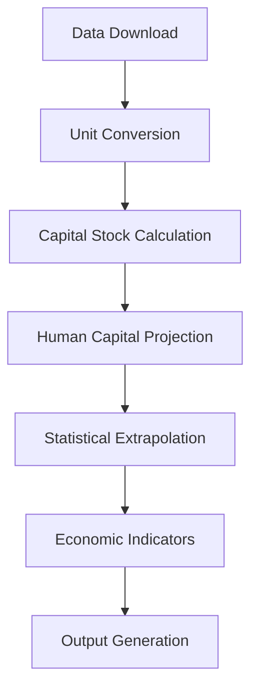

# China Economic Data Analysis

[](https://github.com/fernandoduarte/china_data/actions/workflows/ci.yml)
[](https://github.com/fernandoduarte/china_data/actions/workflows/performance.yml)
[](https://github.com/fernandoduarte/china_data/actions/workflows/dependency-check.yml)
[](https://codecov.io/gh/fernandoduarte/china_data)
[](https://www.python.org/downloads/)
[](https://opensource.org/licenses/MIT)
[](https://github.com/psf/black)

A comprehensive Python package for downloading, processing, and analyzing economic data for China from multiple authoritative sources including the World Bank, Penn World Table, and IMF Fiscal Monitor. Features automated data retrieval, advanced processing pipelines, statistical extrapolation methods, and production-ready CI/CD workflows.

## 🚀 Quick Start

### Prerequisites

- Python 3.9+ (Python 3.13+ recommended)
- Internet connection (for downloading data)
- pip package manager

### Installation

1. **Clone and navigate to the repository:**
   ```bash
   git clone https://github.com/fernandoduarte/china_data.git
   cd china_data
   ```

2. **Run the automated setup:**
   ```bash
   ./setup.sh
   ```

The setup script will automatically:
- Create a Python virtual environment
- Install all required dependencies
- Download and process the latest economic data
- Generate output files in the `output` directory
- Run data integrity tests

### 📊 Data Releases (Public Access)

For researchers who only need the processed data without running the pipeline:

**Latest Data-Only Release:** [Download china-data-only-v1.0.0.zip](https://github.com/fernandoduarte/china_data/releases/latest)

- ✅ **No GitHub account required** for download
- ✅ **Perfect for academic research** and citations  
- ✅ **Stable URLs** for reproducibility
- 📁 Contains: CSV data, documentation, and methodology notes

---

## 📋 Table of Contents

- [🎯 Project Overview](#-project-overview)
- [⚙️ Setup and Installation](#️-setup-and-installation)
- [🔧 Development Tools](#-development-tools)
- [📊 Data Sources and Processing](#-data-sources-and-processing)
- [📖 Usage Examples](#-usage-examples)
- [🐛 Troubleshooting](#-troubleshooting)
- [📚 Academic Use](#-academic-use)
- [🏗️ CI/CD and Workflows](#️-cicd-and-workflows)

---

## 🎯 Project Overview

This package provides a comprehensive solution for economic data analysis focused on China, featuring:

### **🎯 Core Features**
- **Multi-Source Data Integration:** World Bank WDI, Penn World Table, IMF Fiscal Monitor
- **Advanced Statistical Methods:** ARIMA forecasting, linear regression, growth rate extrapolation
- **Economic Indicators:** TFP calculation, capital stock modeling, savings analysis
- **Automated Processing:** Complete pipeline from raw data to publication-ready outputs
- **Academic-Ready:** Comprehensive documentation and citation support

### **🏭 Production-Ready Infrastructure**
- **Comprehensive CI/CD:** 5 sophisticated GitHub Actions workflows
- **Quality Assurance:** 80%+ code coverage, multi-platform testing (15 combinations)
- **Security-First:** Vulnerability scanning, license compliance, automated updates
- **Public Data Access:** Dual release system for researchers and developers

---

## ⚙️ Setup and Installation

### 🔧 Automated Setup (Recommended)

```bash
# Clone repository
git clone https://github.com/fernandoduarte/china_data.git
cd china_data

# Basic setup - data processing only
./setup.sh

# Development setup - includes testing tools
./setup.sh --dev

# Testing only - skip data processing
./setup.sh --test
```

### 📋 Setup Options

```bash
./setup.sh --help
```

**Available options:**
- `--dev`: Install development dependencies and run tests
- `--test`: Install development dependencies and run tests only (skip data processing)
- `-a=VALUE, --alpha=VALUE`: Capital share parameter (default: 0.33)
- `-k=VALUE, --capital-output-ratio=VALUE`: Capital-to-output ratio (default: 3.0)
- `-o=NAME, --output-file=NAME`: Base name for output files (default: china_data_processed)
- `--end-year=YYYY`: Last year to process/download data (default: 2025)

**Example with custom parameters:**
```bash
./setup.sh -a=0.4 -k=2.5 -o=custom_output --end-year=2030 --dev
```

### 🛠️ Manual Setup

<details>
<summary>Click to expand manual setup instructions</summary>

1. **Create virtual environment:**
   ```bash
   python -m venv venv
   # or: python3 -m venv venv
   ```

2. **Activate virtual environment:**
   ```bash
   # macOS/Linux:
   source venv/bin/activate
   
   # Windows:
   venv\Scripts\activate
   ```

3. **Install dependencies:**
   ```bash
   pip install --upgrade pip
   pip install setuptools>=67.0.0  # Required for Python 3.13+
   
   # Production dependencies:
   pip install -r requirements.txt
   
   # Development dependencies:
   pip install -r dev-requirements.txt
   ```

4. **Run the pipeline:**
   ```bash
   python china_data_downloader.py --end-year=2025
   python china_data_processor.py --end-year=2025
   ```
</details>

---

## 🔧 Development Tools

### 🎯 Makefile Commands

```bash
make help          # Show available commands
make install       # Install production dependencies
make install-dev   # Install development dependencies
make format        # Format code (black + isort)
make lint          # Run linting checks (flake8 + pylint)
make test          # Run test suite with coverage
make clean         # Clean up generated files
make run-download  # Download raw data only
make run-process   # Process downloaded data only
```

### 📊 Code Quality Standards

**Enforced Standards:**
- **🎨 Formatting:** Black with 120-character line limit
- **📦 Import Organization:** isort with black-compatible settings
- **🔍 Linting:** flake8 and pylint for style and potential issues
- **🔬 Type Checking:** mypy for enhanced code reliability
- **🧪 Testing:** pytest with 80%+ coverage requirement

**Configuration Files:**
- `.flake8` - Linting rules and exclusions
- `pyproject.toml` - Black, isort, pytest, and mypy configuration
- `config.py` - Centralized project configuration

### ⚙️ Configuration System

All project settings are centralized in `config.py`:

```python
from config import Config

# Access configuration values
alpha = Config.DEFAULT_ALPHA
output_dir = Config.get_output_directory()
column_map = Config.OUTPUT_COLUMN_MAP
```

**Benefits:**
- ✅ Single source of truth for all settings
- ✅ Easy parameter modification
- ✅ Consistent behavior across modules
- ✅ No hardcoded values

---

## 📊 Data Sources and Processing

### 🌍 Data Sources

#### **International Monetary Fund (IMF) Fiscal Monitor**
- **Tax Revenue Data:** G1_S13_POGDP_PT (Tax revenue as % of GDP)
- **Coverage:** Historical data + official IMF projections through 2030
- **Storage:** Pre-downloaded in `input/` directory

#### **World Bank World Development Indicators (WDI)**
- **GDP Components:** NY.GDP.MKTP.CD, NE.CON.PRVT.CD, NE.CON.GOVT.CD, etc.
- **FDI Data:** BX.KLT.DINV.WD.GD.ZS
- **Demographics:** SP.POP.TOTL, SL.TLF.TOTL.IN
- **Download:** Real-time via pandas-datareader

#### **Penn World Table (PWT) v10.01**
- **Real GDP:** rgdpo
- **Capital Stock:** rkna
- **Price Levels:** pl_gdpo, cgdpo
- **Human Capital:** hc
- **Download:** Programmatic during execution

### 🔄 Processing Pipeline



**Pipeline Stages:**

1. **📥 Data Download:** Multi-source data retrieval and merging
2. **🔄 Unit Conversion:** Standardization (billions USD, millions people)
3. **🏭 Capital Stock Calculation:** Using investment data and capital-output ratios
4. **👥 Human Capital Projection:** Linear regression for future projections
5. **📈 Statistical Extrapolation:** ARIMA, linear regression, growth rate methods
6. **📊 Economic Indicators:** TFP, net exports, savings rates, openness ratios
7. **📄 Output Generation:** Markdown and CSV format generation

### 📈 Extrapolation Methods

**🔬 ARIMA Models:** Complex time series (TFP)
**📈 Linear Regression:** Variables with clear trends
**📊 Average Growth Rate:** Stable growth variables

> **Note:** Extrapolation precedes indicator calculation to ensure consistency in projected data.

---

## 📖 Usage Examples

### 🎯 Basic Data Processing

**Default parameters (recommended for most users):**
```bash
./setup.sh
```
Generates complete dataset with projections using α=0.33, capital-output ratio=3.0

### 🔧 Custom Economic Analysis

**Different theoretical assumptions:**
```bash
./setup.sh -a=0.4 -k=3.5 --end-year=2030
```
- **Higher capital share (α=0.4):** Tests capital-intensive growth models
- **Different capital-output ratio:** Affects capital stock calculations
- **Extended projections:** Provides longer-term forecasts

### 📊 Data Export for External Analysis

**Generate files for statistical software:**
```bash
python china_data_downloader.py --end-year=2025
python china_data_processor.py -o analysis_data --end-year=2025
```
Output CSV can be imported into R, Stata, Excel, or visualization tools

### 🔄 Development Workflow

**Complete development setup with testing:**
```bash
./setup.sh --dev
```
Installs development tools, processes data, and runs comprehensive test suite

### 📈 Updating with Latest Data

**Refresh data with new releases:**
```bash
./setup.sh --dev  # Downloads latest data and validates
```

---

## 🐛 Troubleshooting

### 🔧 Common Issues

#### **🧪 Test Failures**
```bash
# Local debugging
pytest tests/ -v --tb=long

# Check coverage
pytest tests/ --cov=. --cov-report=html
```

#### **🔒 Security and Code Quality Issues**
```bash
# Local security scan
bandit -r . --exclude "./venv/*,./tests/*"

# Check code formatting
black --check . --exclude=venv
isort --check . --skip venv

# Check linting
flake8 . --exclude=venv
```

#### **📦 Dependency Conflicts**
```bash
# Analyze dependency tree
pip install pipdeptree
pipdeptree --warn=fail

# Resolve with pip-tools
pip install pip-tools
pip-compile requirements.in --upgrade
```

### 🐍 Python Compatibility

**Python 3.13+ Requirements:**
- Ensure `setuptools>=67.0.0` installed first
- Required for pandas-datareader compatibility
- Setup script handles this automatically

### 🌐 API Rate Limits

**If encountering API limits:**
- Built-in retry mechanisms with exponential backoff
- Automatic delays between requests
- Manual re-run capability


### 📊 Missing Data Handling

**Automatic gap filling:**
- Processor uses statistical methods for missing data
- Check extrapolation section in output markdown for methods used
- Modify interpolation in `utils/processor_extrapolation.py` if needed

---

## 📚 Academic Use

### 🎓 For Researchers

**Direct Data Access (No Setup Required):**
- **📥 Download:** [Latest data-only release](https://github.com/fernandoduarte/china_data/releases/latest)
- **🔗 Stable URLs:** Perfect for academic citations
- **📖 Documentation:** Comprehensive methodology notes included

**Research Applications:**
- **📊 Economic Analysis:** GDP components, growth accounting, productivity analysis
- **🎓 Teaching:** Pre-processed datasets for classroom use
- **📰 Policy Analysis:** Government and NGO research
- **📈 Journalism:** Economic reporting with current indicators
- **🔬 Reproducible Research:** Versioned data with methodology documentation

### 📖 Citation Guidelines

**When using this package or data:**

```bibtex
@software{duarte2025china,
  title={China Economic Data Analysis Package},
  author={Duarte, Fernando},
  year={2025},
  institution={Brown University, Department of Economics},
  url={https://github.com/fernandoduarte/china_data},
  version={v1.0.0}
}
```

**Also cite original data sources:**
1. **World Bank WDI:** Available under [CC BY 4.0](https://creativecommons.org/licenses/by/4.0/)
2. **Penn World Table:** [Feenstra, Inklaar & Timmer (2015)](https://www.rug.nl/ggdc/productivity/pwt/)
3. **IMF Fiscal Monitor:** Per [IMF Terms](https://www.imf.org/external/terms.htm)

### 🎯 Educational Value

**Learning Outcomes:**
- **📊 Data Pipeline Development:** Real-world economic data processing
- **🔬 Statistical Methods:** ARIMA, regression, growth rate extrapolation
- **🏭 Production Practices:** CI/CD, testing, documentation, security
- **🐍 Python Ecosystem:** pandas, scikit-learn, statsmodels, pytest

---

## 📁 Project Structure

```
china_data/
├── 🚀 Main Scripts
│   ├── china_data_downloader.py     # Data downloading pipeline
│   ├── china_data_processor.py      # Data processing pipeline
│   └── config.py                    # Centralized configuration
├── 🛠️ Development Tools
│   ├── setup.sh                     # Automated setup script
│   ├── Makefile                     # Development task automation
│   ├── requirements.txt             # Production dependencies
│   ├── dev-requirements.txt         # Development dependencies
│   └── pyproject.toml               # Tool configurations
├── 🏗️ CI/CD Infrastructure
│   └── .github/workflows/           # GitHub Actions workflows (see .github/workflows/README.md)
├── 📁 Data Directories
│   ├── input/                       # Pre-downloaded data (IMF)
│   └── output/                      # Generated output files
├── 🧪 Testing Suite
│   ├── tests/
│   │   ├── test_downloader.py       # Download functionality tests
│   │   ├── test_processor_*.py      # Processing module tests
│   │   └── data_integrity/          # Data validation tests
│   └── utils/                       # Utility modules
│       ├── capital/                 # Capital stock calculations
│       ├── data_sources/            # Data source handlers
│       ├── extrapolation_methods/   # Statistical methods
│       └── processor_dataframe/     # DataFrame operations
```

---

## 📄 Output Files

All processed data is stored in the `output/` directory:

### 📊 Generated Files

- **`china_data_raw.md`** - Raw data with source attribution and download dates
- **`china_data_processed.md`** - Processed data with calculation methodology and extrapolation details
- **`china_data_processed.csv`** - Machine-readable CSV format for analysis tools

### 📋 Data Content

**Economic Indicators:**
- GDP and components (consumption, investment, government, trade)
- Total Factor Productivity (TFP) calculations
- Capital stock modeling and projections
- Demographics and labor force data
- Fiscal indicators (tax revenue, savings rates)
- Trade metrics (openness ratio, net exports)

**Time Coverage:**
- Historical data from available sources (typically 1960s+)
- Projections to specified end year (default: 2025)
- Clear documentation of extrapolation methods used

---


## 🤝 Contributing

### 🔄 Development Workflow

1. **🍴 Fork the repository**
2. **🌿 Create feature branch:** `git checkout -b feature/amazing-feature`
3. **🧪 Run tests:** `make test`
4. **🎨 Format code:** `make format`
5. **📝 Commit changes:** `git commit -m 'Add amazing feature'`
6. **🚀 Push branch:** `git push origin feature/amazing-feature`
7. **📬 Open Pull Request**

### 📋 Quality Requirements

- ✅ All tests must pass locally and in CI
- ✅ Code coverage should remain ≥80%
- ✅ Code must be formatted with Black (120-char limit)
- ✅ Code must pass linting checks (flake8, pylint)
- ✅ Documentation must be updated for new features

---

## 📜 License

**MIT License** - See LICENSE file for details.

**Academic Use:** This project is designed for educational and research purposes. Feel free to use, modify, and distribute with proper attribution.

**Data Licensing:** Users must comply with original data source terms:
- **World Bank WDI:** [CC BY 4.0](https://creativecommons.org/licenses/by/4.0/)
- **Penn World Table:** Academic use with proper citation
- **IMF Fiscal Monitor:** Per [IMF Terms](https://www.imf.org/external/terms.htm)

---

## 📞 Support

### 🆘 Getting Help

- **🐛 Issues:** [GitHub Issues](https://github.com/fernandoduarte/china_data/issues)
- **💬 Discussions:** [GitHub Discussions](https://github.com/fernandoduarte/china_data/discussions)
- **📖 Documentation:** This README and workflow documentation in `.github/workflows/README.md`

### 🔍 Before Reporting Issues

1. **📋 Check existing issues** for similar problems
2. **🧪 Run local tests** to reproduce the issue
3. **📊 Include system information** (OS, Python version)
4. **📝 Provide error messages** and relevant log output

---

## 🏗️ CI/CD and Workflows

This project features a **comprehensive CI/CD pipeline** with 5 sophisticated GitHub Actions workflows designed specifically for academic research environments. The pipeline provides:

- **🧪 Automated Testing:** Cross-platform testing across 15 combinations (3 OS × 5 Python versions)
- **🔒 Security Scanning:** Automated vulnerability detection and license compliance
- **📦 Dual Releases:** Full pipeline and data-only releases for different user types
- **🤖 Intelligent Automation:** Automated dependency updates and project management
- **📊 Quality Assurance:** 80%+ code coverage enforcement and comprehensive monitoring

### 📋 Key Benefits

- ✅ **Academic-Focused Design:** Optimized for research environments and educational use
- ✅ **Production-Ready Quality:** 30-50% build time improvements through intelligent caching
- ✅ **Privacy-First Approach:** No external services accessing sensitive research data
- ✅ **Public Data Access:** Data-only releases downloadable without GitHub account

### 📖 Complete Documentation

For comprehensive information about our CI/CD workflows, configuration, troubleshooting, and contributing requirements, see:

**📁 [.github/workflows/README.md](.github/workflows/README.md)**

This detailed documentation covers:
- 🚀 Workflow architecture and design principles
- 🔒 Security framework and quality metrics
- 🎯 Performance optimization strategies
- 🔧 Configuration and setup instructions
- 🐛 Troubleshooting and debugging guides
- 🤝 Contributing requirements and review process

---

**🎓 Developed at Brown University Department of Economics**  
**📅 Version:** 1.0.0 | **📅 Updated:** January 2025  
**👨‍💻 Author:** Fernando Duarte  
**🏛️ Institution:** Brown University, Department of Economics  
**📊 Status:** ✅ Production Ready | **🔒 Security:** ✅ Comprehensive | **🧪 Coverage:** 80%+
