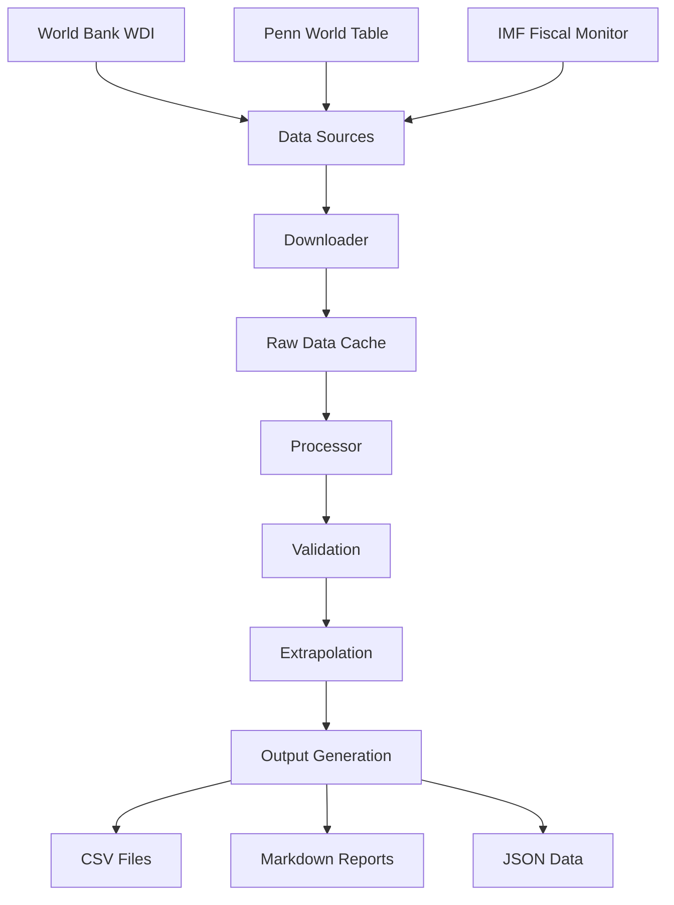

# China Economic Data Analysis

[](https://github.com/fernandoduarte/china_data/actions/workflows/ci.yml)
[](https://github.com/fernandoduarte/china_data/actions/workflows/performance.yml)
[](https://github.com/fernandoduarte/china_data/actions/workflows/dependency-check.yml)
[](https://codecov.io/gh/fernandoduarte/china_data)
[](https://www.python.org/downloads/)
[](https://opensource.org/licenses/MIT)
[](https://github.com/psf/black)

A comprehensive Python package for downloading, processing, and analyzing economic data for China from multiple authoritative sources including the World Bank, Penn World Table, and IMF Fiscal Monitor.

## Features

!!! tip "Key Capabilities"

    - **Automated Data Retrieval**: Download economic indicators from World Bank WDI, Penn World Table, and IMF Fiscal Monitor
    - **Intelligent Processing**: Clean, validate, and harmonize data from multiple sources
    - **Statistical Extrapolation**: Extend time series using multiple econometric methods
    - **Flexible Output**: Generate data in multiple formats (CSV, Markdown, JSON)
    - **Robust Testing**: Comprehensive test suite with data integrity validation
    - **Modern Tooling**: Type hints, linting, security scanning, and CI/CD workflows

## Quick Start

Get up and running in minutes:

=== "Automated Setup"

    ```bash
    git clone https://github.com/fernandoduarte/china_data.git
    cd china_data
    ./setup.sh
    ```

=== "Manual Setup"

    ```bash
    git clone https://github.com/fernandoduarte/china_data.git
    cd china_data
    python -m venv venv
    source venv/bin/activate  # On Windows: venv\Scripts\activate
    pip install -r requirements.txt
    python china_data_downloader.py
    python china_data_processor.py
    ```

=== "Docker"

    ```bash
    git clone https://github.com/fernandoduarte/china_data.git
    cd china_data
    docker compose run --rm dev
    ```

## Data Sources

This package integrates data from three authoritative sources:

| Source                 | Coverage     | License                                                   | Key Indicators                    |
| ---------------------- | ------------ | --------------------------------------------------------- | --------------------------------- |
| **World Bank WDI**     | 1960-present | [CC BY 4.0](https://creativecommons.org/licenses/by/4.0/) | GDP, Population, Labor Force      |
| **Penn World Table**   | 1950-2019    | Academic Use                                              | Capital Stock, TFP, Human Capital |
| **IMF Fiscal Monitor** | 1990-present | [IMF Terms](https://www.imf.org/external/terms.htm)       | Government Debt, Fiscal Balance   |

## Architecture Overview



## Example Usage

```python
from config import Config
from utils.data_sources.world_bank import WorldBankDataSource
from utils.processor_dataframe.processor import DataProcessor

# Configure data parameters
config = Config()
config.set_alpha(0.33)  # Capital share
config.set_capital_output_ratio(3.0)  # K/Y ratio

# Download data
wb_source = WorldBankDataSource()
data = wb_source.fetch_data(['NY.GDP.MKTP.KD', 'SP.POP.TOTL'])

# Process and extrapolate
processor = DataProcessor(data)
processed_data = processor.process_all()
```

!!! example "Interactive Example"

    Try running the following in a Jupyter notebook:

    ```python
    # This example demonstrates basic usage
    import pandas as pd
    from china_data_processor import ChinaDataProcessor

    # Load processed data
    processor = ChinaDataProcessor()
    data = processor.load_output_data()

    # Display key statistics
    print(f"Data coverage: {data.index.min()} - {data.index.max()}")
    print(f"Available indicators: {list(data.columns)}")

    # Plot GDP growth
    data['gdp_growth'] = data['gdp'].pct_change() * 100
    data['gdp_growth'].plot(title='China GDP Growth Rate')
    ```

## Next Steps

<div class="grid cards" markdown>

- :material-rocket-launch:{ .lg .middle } **Getting Started**

  ***

  Learn how to install and configure the package for your needs

  [:octicons-arrow-right-24: Installation Guide](getting-started/installation.md)

- :material-book-open-page-variant:{ .lg .middle } **User Guide**

  ***

  Comprehensive documentation on data sources, processing, and customization

  [:octicons-arrow-right-24: User Guide](user-guide/data-sources.md)

- :material-api:{ .lg .middle } **API Reference**

  ***

  Detailed documentation of all classes, functions, and modules

  [:octicons-arrow-right-24: API Documentation](api/core.md)

- :material-hammer-wrench:{ .lg .middle } **Development**

  ***

  Contributing guidelines, architecture decisions, and development setup

  [:octicons-arrow-right-24: Development Guide](development/contributing.md)

</div>

## Citation

If you use this package in your research, please cite the original data sources:

!!! quote "Data Source Citations"

    **World Bank WDI**: World Bank. (2024). World Development Indicators. Available under [CC BY 4.0](https://creativecommons.org/licenses/by/4.0/)

    **Penn World Table**: Feenstra, R. C., Inklaar, R., & Timmer, M. P. (2015). The next generation of the Penn World Table. *American Economic Review*, 105(10), 3150-3182.

    **IMF Fiscal Monitor**: International Monetary Fund. (2024). Fiscal Monitor Database. Available under [IMF Terms](https://www.imf.org/external/terms.htm)

## License

This project is licensed under the MIT License - see the [LICENSE](https://github.com/fernandoduarte/china_data/blob/main/LICENSE) file for details.

!!! warning "Data Licensing"

    While this package is MIT licensed, users must comply with the original data source terms:

    - World Bank WDI: [CC BY 4.0](https://creativecommons.org/licenses/by/4.0/)
    - Penn World Table: Academic use with proper citation
    - IMF Fiscal Monitor: Per [IMF Terms](https://www.imf.org/external/terms.htm)
